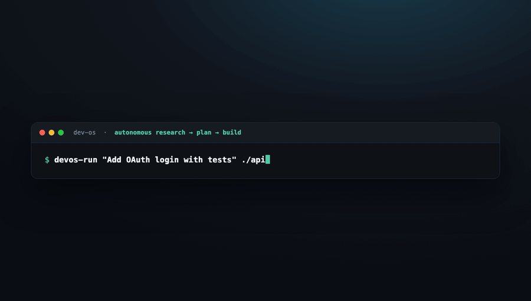

# dev-os ☤

**An autonomous agent org that researches, plans, and ships — one command, gated once.**

<p align="center">
  
</p>

`dev-os` is a small, shallow team of AI agents for the [Hermes](https://hermes-agent.nousresearch.com)
platform that sits **above** [`hermes-devcrew`](https://github.com/must-mohsin1/hermes-devcrew) (the
9-agent implementation team). You give it a goal; it researches with Grok, writes a spec, asks you to
**approve the plan once**, then dispatches the build to devcrew and reports back.

```
            You ── Discord
                 │ goal
                 ▼
        ┌──────  devos  ──────┐          coordinator (Codex) — routes, gates, tracks
        ▼          ▼          ▼
   researcher   planner    devcrew        researcher (Grok) · planner (Codex) · devcrew (dependency)
   (Grok)       (Codex)    (9 agents)
        └──── kanban board ────┘
   cron: improvement loop → re-runs research+plan on "improve project X"
```

## The pipeline
```
devos-run "Add OAuth login with tests" /path/to/repo
  research (Grok)  → cited brief
  plan    (Codex)  → spec with checkable acceptance criteria
  [approve?]       → one human gate on Discord       (--no-gate to skip)
  build            → devcrew-run "<spec>" <repo>
  report           → 1-3-1 summary
devos-improve /path/to/repo      # propose the top improvement (research+plan, no build)
```

## The team (3 agents + devcrew dependency)
| Agent | Model | Job | Headline skills |
|---|---|---|---|
| **devos** | Codex `gpt-5.3-codex` | decompose · route · gate · track · report | `coordinate-and-route`, `decision-brief`, `one-three-one-rule` |
| **devos-researcher** | Grok `grok-4.20-reasoning` (deep `grok-4.3`) | Grok web research → cited briefs (≤3 sub-searchers) | `grok-deep-research`, `parallel-cli`, `domain-intel`, `osint-investigation` |
| **devos-planner** | Codex `gpt-5.3-codex` | goal+brief → approval-ready spec | `write-spec`, `spec-critic`, `synthesize-research` |
| **devcrew** | (external) | implementation | the [hermes-devcrew](https://github.com/must-mohsin1/hermes-devcrew) package |

Each agent is a Hermes **profile distribution** (`distribution.yaml` + `SOUL.md` + `config.yaml` +
`skills/`) — 21 skills total, no registry needed.

## Install
**Prereqs:** [Hermes](https://hermes-agent.nousresearch.com/docs/), `hermes-devcrew`, and OAuth for
Codex + Grok:
```bash
hermes auth add openai-codex --type oauth     # main model
hermes auth add xai-oauth --type oauth          # Grok web search
git clone https://github.com/must-mohsin1/dev-os && cd dev-os
./install.sh                 # installs the 3 agents, links runners, checks devcrew + OAuth
./install.sh --with-cron     # + nightly improvement loop (set DEVOS_IMPROVE_REPO)
```

## Models & policy
One coordinator on **Codex**, research on **Grok** (xAI), implementation on devcrew's OpenRouter
models. Fallback: `openai/gpt-5.5`, `deepseek/deepseek-v4-pro`. **Never Claude or Gemini.** Comms: Discord.

## Safety
One human gate at the plan (`--no-gate` to remove); destructive build actions stay gated inside
devcrew; auditable kanban event stream; each task runs in an isolated workspace.

## License
MIT — see [LICENSE](LICENSE). Design: [`docs/superpowers/specs/`](docs/superpowers/specs/).
